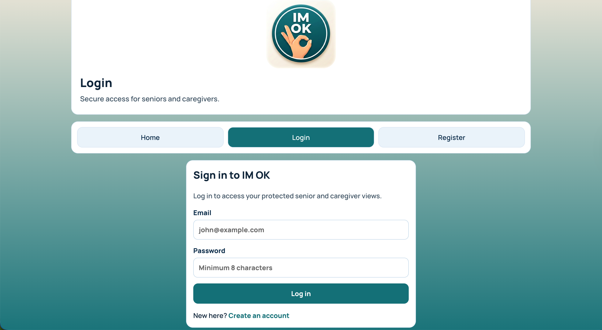
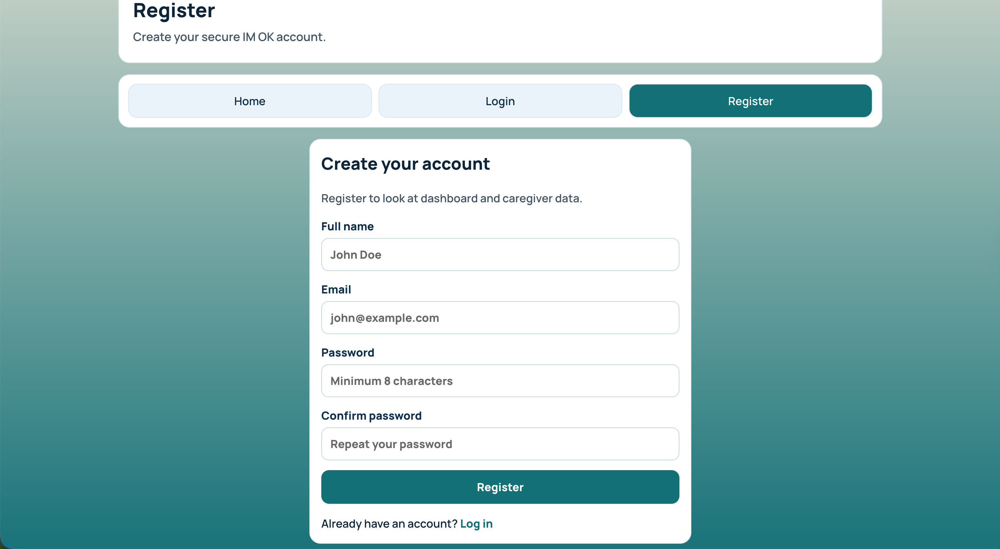
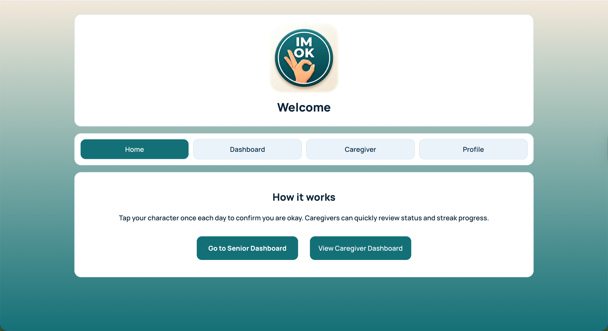
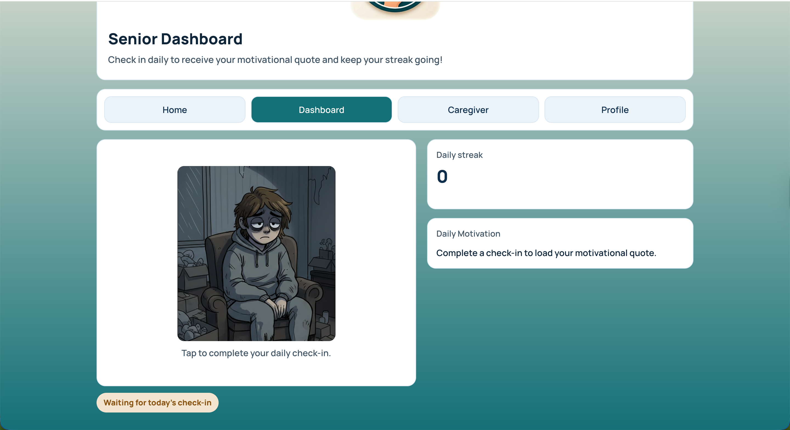
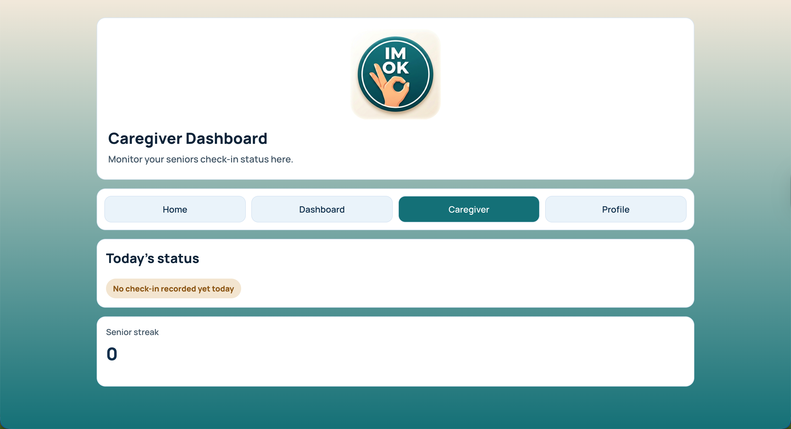
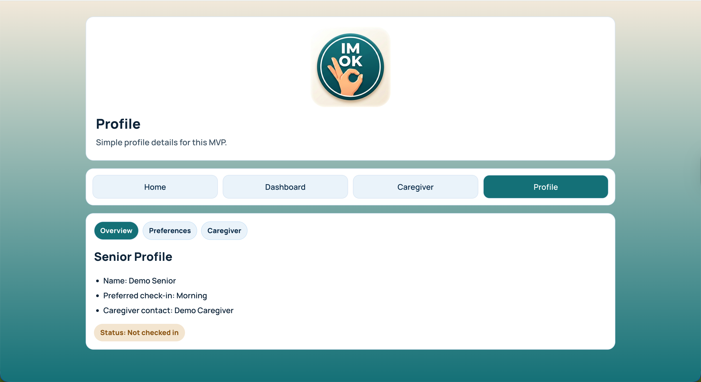

# IM OK - Final Submission

IM OK is a React + Vite single-page MVP for daily senior check-ins. A senior can complete a daily check-in from the dashboard, receive a motivational quote from an external API, and caregivers can view status and streak progress.

## Links

- Public GitHub Repository: [Final Project MVP: IM OK](https://github.com/micode-maker/Final-Project-MVP-IM-OK)
- Deployed Vercel App: [IM OK on Vercel](https://final-project-mvp-im-ok-michael-hos-projects-00257bb5.vercel.app/)


## Problem Statement

Seniors living alone need a simple daily check-in workflow. Caregivers need quick visibility into whether a senior has checked in. IM OK provides a clear daily interaction with motivational reinforcement and caregiver-facing status visibility.

## Tech Stack

- React
- Vite
- React Router DOM
- Vitest
- React Testing Library
- CSS

## Project Structure

```text
src/
  components/
    CharacterCard.jsx
    Header.jsx
    NavButtons.jsx
    QuoteCard.jsx
    StatusBadge.jsx
    StreakDisplay.jsx
  contexts/
    AuthContext.jsx
    CheckInContext.jsx
    checkInContext.js
    useCheckIn.js
  pages/
    Caregiver.jsx
    Dashboard.jsx
    Home.jsx
    Login.jsx
    NotFound.jsx
    Profile.jsx
    Register.jsx
  utilities/
    fetchQuote.js
  App.css
  App.jsx
  App.test.jsx
  index.css
  main.jsx
```

## Routes

- `/` Home (public)
- `/auth/login` Login (public)
- `/auth/register` Register (public)
- `/dashboard` Senior dashboard (protected)
- `/caregiver` Caregiver dashboard (protected)
- `/profile` Profile (protected)
- `/profile/:section` Profile section (protected)
- `*` Not Found

## Setup and Installation

1. Install dependencies:

```bash
npm install
```

2. Add environment variables:

```bash
VITE_API_NINJAS_KEY=your_api_ninjas_key_here
VITE_JWT_SECRET=replace_with_a_long_random_secret
```

3. Start development server:

```bash
npm run dev
```

## API Integration

- Quotes API: `https://api.api-ninjas.com/v2/quotes`
- Utility file: `src/utilities/fetchQuote.js`
- Categories: `success,wisdom,inspirational,faith,happiness,courage,humor,love`


## Testing

Run tests:

```bash
npm run test
```

## Build and Deployment

Build locally:

```bash
npm run build
```

## Screenshots

.png)







## Known Issues

- Authentication and JWT run fully in the frontend for course scope.
- Because this is a frontend-only app, user accounts are stored in browser storage.

## Future Enchancements

- Backend integration
- Further development on profile page, add check-in window preferences and adjustable user information.
